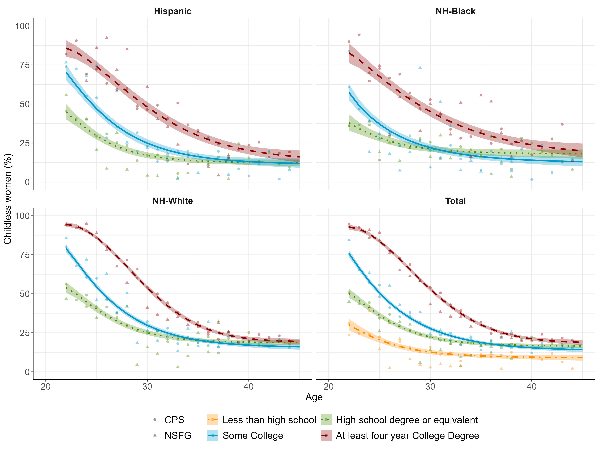

<!-- README.md is generated from README.Rmd. Please edit that file -->

```{r, include = FALSE}
knitr::opts_chunk$set(
  collapse = TRUE,
  comment = "#>"
)
```

## Trends and Patterns in Childlessness by Age, Race, Ethnicity, and Education in the United States: A Research Note




This repository, [`childless_us`](https://github.com/benjisamschlu/childless_us), contains reproducible code for manuscript, "Trends and Patterns in Childlessness by Age, Race, Ethnicity, and Education in the United States: A Research Note", which uses publicly-available data from the [Current Population Survey](https://cps.ipums.org/cps/) and the [National Survey of Family Growth](https://www.cdc.gov/nchs/nsfg/index.htm). 


## Keypoints

**Aim.** We develop a Bayesian parametric model to estimate the proportion of women who are childless by age, race and ethnicity, and education for birth cohorts 1950-1999 using data from the Current Population Survey and the National Survey of Family Growth.

**Findings.** We show that there have been substantial changes to childbearing trajectories in the United States, with an increase in the share of women who are childless at most ages. For the 1950-1954 birth cohort, the age by which 50% of women had a child was 24 years, while for the 1990-1994 cohort it had risen to 29 years. Childlessness declines rapidly at early ages for those with a high school degree only, while those with a college degree enter parenthood later. Increases in childlessness at younger ages have not yet had substantial effects on the share of women without children at age 45, which has risen for some groups but fallen for others, particularly the most-educated mothers. 


## About this repository

All code can be found in the `./codes` folder and must be run in order. The first few lines of each code file contains a brief description of the tasks related to that file. Figures are in the `./outputs/figures` folder. 


## Authors
-   [Benjamin-Samuel Schlüter](https://www.benjaminschluter.com/)
-   [Leslie Root](https://leslieroot.net/about/)
-   [Monica Alexander](https://www.monicaalexander.com/)   


## Notes on Reproducibility

We use publicly available data and provide code that will download NSFG data. Regarding CPS data, you need to extract the data from [IPUMS](https://cps.ipums.org/cps/). Your extract (in .csv format) needs to include the variables: *year, month, serial, pernum, momloc, momloc2, poploc, poploc2, frever, wtfinl, educ, age, sex, race, hispan, nativity*. Then place the extract in `./inputs/data`. For the validation with the [Human Fertility Database](https://www.humanfertility.org/Home/Index), you will need to create an account if you don't have one yet.

We use [`renv`](https://rstudio.github.io/renv/index.html) for package management but below we also post the relevant session information to ensure full reproducibility. 

```{r, eval=FALSE}
> sessioninfo::session_info()
─ Session info ─────────────────────────────────────────────────────────────────────
 setting  value
 version  R version 4.4.0 (2024-04-24 ucrt)
 os       Windows 11 x64 (build 26200)
 system   x86_64, mingw32
 ui       RStudio
 language (EN)
 collate  English_United States.utf8
 ctype    English_United States.utf8
 tz       Europe/Berlin
 date     2026-03-26
 rstudio  2024.04.0+735 Chocolate Cosmos (desktop)
 pandoc   3.1.11 @ C:/Program Files/RStudio/resources/app/bin/quarto/bin/tools/ (via rmarkdown)
 quarto   ERROR: Unknown command "TMPDIR=C:/Users/schlueter/AppData/Local/Temp/Rtmpkl5Hdn/file69a024176272". Did you mean command "create"? @ C:\\PROGRA~1\\RStudio\\RESOUR~1\\app\\bin\\quarto\\bin\\quarto.exe

─ Packages ─────────────────────────────────────────────────────────────────────────
 ! package          * version  date (UTC) lib source
   abind              1.4-8    2024-09-12 [1] CRAN (R 4.4.1)
   arrayhelpers       1.1-0    2020-02-04 [1] CRAN (R 4.4.2)
   asciiSetupReader   2.5.2    2024-08-17 [1] CRAN (R 4.4.3)
   backports          1.5.0    2024-05-23 [1] CRAN (R 4.4.0)
   checkmate          2.3.2    2024-07-29 [1] CRAN (R 4.4.2)
   cli                3.6.3    2024-06-21 [1] CRAN (R 4.4.2)
   coda               0.19-4.1 2024-01-31 [1] CRAN (R 4.4.2)
 P codetools          0.2-20   2024-03-31 [?] CRAN (R 4.4.0)
   colorspace         2.1-1    2024-07-26 [1] CRAN (R 4.4.2)
   curl               6.4.0    2025-06-22 [1] CRAN (R 4.4.3)
   data.table         1.16.4   2024-12-06 [1] CRAN (R 4.4.2)
   digest             0.6.37   2024-08-19 [1] CRAN (R 4.4.2)
   distributional     0.5.0    2024-09-17 [1] CRAN (R 4.4.2)
   dplyr            * 1.1.4    2023-11-17 [1] CRAN (R 4.4.2)
   evaluate           1.0.4    2025-06-18 [1] CRAN (R 4.4.3)
   farver             2.1.2    2024-05-13 [1] CRAN (R 4.4.2)
   fastmap            1.2.0    2024-05-15 [1] CRAN (R 4.4.2)
   forcats          * 1.0.0    2023-01-29 [1] CRAN (R 4.4.2)
   generics           0.1.4    2025-05-09 [1] CRAN (R 4.4.3)
   ggdist             3.3.3    2025-04-23 [1] CRAN (R 4.4.3)
   ggplot2          * 3.5.2    2025-04-09 [1] CRAN (R 4.4.3)
   glue               1.8.0    2024-09-30 [1] CRAN (R 4.4.2)
   gridExtra        * 2.3      2017-09-09 [1] CRAN (R 4.4.2)
   gtable             0.3.6    2024-10-25 [1] CRAN (R 4.4.2)
   here             * 1.0.1    2020-12-13 [1] CRAN (R 4.4.2)
   HMDHFDplus       * 2.0.8    2025-10-03 [1] RSPM
   hms                1.1.3    2023-03-21 [1] CRAN (R 4.4.2)
   htmltools          0.5.8.1  2024-04-04 [1] CRAN (R 4.4.2)
   httr               1.4.7    2023-08-15 [1] CRAN (R 4.4.2)
   inline             0.3.21   2025-01-09 [1] CRAN (R 4.4.2)
   janitor            2.2.1    2024-12-22 [1] RSPM
   knitr              1.50     2025-03-16 [1] CRAN (R 4.4.3)
   labeling           0.4.3    2023-08-29 [1] CRAN (R 4.4.0)
   lattice            0.22-6   2024-03-20 [1] CRAN (R 4.4.0)
   lifecycle          1.0.4    2023-11-07 [1] CRAN (R 4.4.2)
   loo                2.8.0    2024-07-03 [1] CRAN (R 4.4.2)
   lubridate        * 1.9.4    2024-12-08 [1] CRAN (R 4.4.2)
   magrittr           2.0.3    2022-03-30 [1] CRAN (R 4.4.2)
   matrixStats        1.5.0    2025-01-07 [1] CRAN (R 4.4.2)
   munsell            0.5.1    2024-04-01 [1] CRAN (R 4.4.2)
   pillar             1.11.0   2025-07-04 [1] CRAN (R 4.4.3)
   pkgbuild           1.4.5    2024-10-28 [1] CRAN (R 4.4.2)
   pkgconfig          2.0.3    2019-09-22 [1] CRAN (R 4.4.2)
   posterior          1.6.0    2024-07-03 [1] CRAN (R 4.4.2)
   purrr            * 1.0.4    2025-02-05 [1] CRAN (R 4.4.3)
   QuickJSR           1.5.1    2025-01-08 [1] CRAN (R 4.4.2)
   R6                 2.6.1    2025-02-15 [1] CRAN (R 4.4.3)
   ragg               1.4.0    2025-04-10 [1] CRAN (R 4.4.3)
   RColorBrewer       1.1-3    2022-04-03 [1] CRAN (R 4.4.0)
   Rcpp               1.0.13-1 2024-11-02 [1] CRAN (R 4.4.2)
 D RcppParallel       5.1.9    2024-08-19 [1] CRAN (R 4.4.2)
   readr            * 2.1.5    2024-01-10 [1] CRAN (R 4.4.2)
   renv               1.1.8    2026-03-05 [1] CRAN (R 4.4.3)
   rlang              1.1.4    2024-06-04 [1] CRAN (R 4.4.2)
   rmarkdown          2.29     2024-11-04 [1] CRAN (R 4.4.2)
   rprojroot          2.0.4    2023-11-05 [1] CRAN (R 4.4.2)
   rstan            * 2.32.6   2024-03-05 [1] CRAN (R 4.4.2)
   rstudioapi         0.17.1   2024-10-22 [1] CRAN (R 4.4.2)
   rvest              1.0.4    2024-02-12 [1] CRAN (R 4.4.2)
   scales             1.3.0    2023-11-28 [1] CRAN (R 4.4.2)
   selectr            0.4-2    2019-11-20 [1] CRAN (R 4.4.2)
   sessioninfo        1.2.3    2025-02-05 [1] RSPM
   snakecase          0.11.1   2023-08-27 [1] RSPM
   StanHeaders      * 2.32.10  2024-07-15 [1] CRAN (R 4.4.3)
   stringi            1.8.4    2024-05-06 [1] CRAN (R 4.4.0)
   stringr          * 1.5.1    2023-11-14 [1] CRAN (R 4.4.2)
   svUnit             1.0.6    2021-04-19 [1] CRAN (R 4.4.2)
   systemfonts        1.2.3    2025-04-30 [1] CRAN (R 4.4.3)
   tensorA            0.36.2.1 2023-12-13 [1] CRAN (R 4.4.0)
   textshaping        0.4.1    2024-12-06 [1] CRAN (R 4.4.2)
   tibble           * 3.2.1    2023-03-20 [1] CRAN (R 4.4.2)
   tidybayes        * 3.0.7    2024-09-15 [1] CRAN (R 4.4.2)
   tidyr            * 1.3.1    2024-01-24 [1] CRAN (R 4.4.2)
   tidyselect         1.2.1    2024-03-11 [1] CRAN (R 4.4.2)
   tidyverse        * 2.0.0    2023-02-22 [1] CRAN (R 4.4.2)
   timechange         0.3.0    2024-01-18 [1] CRAN (R 4.4.2)
   tzdb               0.5.0    2025-03-15 [1] CRAN (R 4.4.3)
   utf8               1.2.4    2023-10-22 [1] CRAN (R 4.4.2)
   vctrs              0.6.5    2023-12-01 [1] CRAN (R 4.4.2)
   withr              3.0.2    2024-10-28 [1] CRAN (R 4.4.2)
   xfun               0.52     2025-04-02 [1] CRAN (R 4.4.3)
   xml2               1.3.6    2023-12-04 [1] CRAN (R 4.4.2)
   yaml               2.3.10   2024-07-26 [1] CRAN (R 4.4.2)

 [1] U:/reproducibles/childlessness_us/renv/library/windows/R-4.4/x86_64-w64-mingw32
 [2] C:/Users/schlueter/AppData/Local/R/cache/R/renv/sandbox/windows/R-4.4/x86_64-w64-mingw32/88765555

 * ── Packages attached to the search path.
 P ── Loaded and on-disk path mismatch.
 D ── DLL MD5 mismatch, broken installation.

────────────────────────────────────────────────────────────────────────────────────
```

```{r, eval=FALSE}
> sessionInfo()
R version 4.4.0 (2024-04-24 ucrt)
Platform: x86_64-w64-mingw32/x64
Running under: Windows 11 x64 (build 26200)

Matrix products: default


locale:
[1] LC_COLLATE=English_United States.utf8  LC_CTYPE=English_United States.utf8   
[3] LC_MONETARY=English_United States.utf8 LC_NUMERIC=C                          
[5] LC_TIME=English_United States.utf8    

time zone: Europe/Berlin
tzcode source: internal

attached base packages:
[1] stats     graphics  grDevices datasets  utils     methods   base     

other attached packages:
 [1] HMDHFDplus_2.0.8    tidybayes_3.0.7     gridExtra_2.3       rstan_2.32.6       
 [5] StanHeaders_2.32.10 here_1.0.1          lubridate_1.9.4     forcats_1.0.0      
 [9] stringr_1.5.1       dplyr_1.1.4         purrr_1.0.4         readr_2.1.5        
[13] tidyr_1.3.1         tibble_3.2.1        ggplot2_3.5.2       tidyverse_2.0.0    

loaded via a namespace (and not attached):
 [1] gtable_0.3.6           tensorA_0.36.2.1       xfun_0.52             
 [4] QuickJSR_1.5.1         inline_0.3.21          lattice_0.22-6        
 [7] tzdb_0.5.0             vctrs_0.6.5            tools_4.4.0           
[10] generics_0.1.4         curl_6.4.0             stats4_4.4.0          
[13] parallel_4.4.0         pkgconfig_2.0.3        data.table_1.16.4     
[16] checkmate_2.3.2        RColorBrewer_1.1-3     distributional_0.5.0  
[19] RcppParallel_5.1.9     lifecycle_1.0.4        compiler_4.4.0        
[22] farver_2.1.2           textshaping_0.4.1      munsell_0.5.1         
[25] janitor_2.2.1          codetools_0.2-20       snakecase_0.11.1      
[28] htmltools_0.5.8.1      yaml_2.3.10            pillar_1.11.0         
[31] arrayhelpers_1.1-0     sessioninfo_1.2.3      abind_1.4-8           
[34] posterior_1.6.0        rvest_1.0.4            digest_0.6.37         
[37] tidyselect_1.2.1       svUnit_1.0.6           stringi_1.8.4         
[40] asciiSetupReader_2.5.2 labeling_0.4.3         fastmap_1.2.0         
[43] rprojroot_2.0.4        grid_4.4.0             colorspace_2.1-1      
[46] cli_3.6.3              magrittr_2.0.3         loo_2.8.0             
[49] pkgbuild_1.4.5         utf8_1.2.4             withr_3.0.2           
[52] scales_1.3.0           backports_1.5.0        timechange_0.3.0      
[55] httr_1.4.7             rmarkdown_2.29         matrixStats_1.5.0     
[58] ragg_1.4.0             hms_1.1.3              evaluate_1.0.4        
[61] coda_0.19-4.1          knitr_1.50             ggdist_3.3.3          
[64] rlang_1.1.4            Rcpp_1.0.13-1          glue_1.8.0            
[67] selectr_0.4-2          xml2_1.3.6             renv_1.1.8            
[70] rstudioapi_0.17.1      R6_2.6.1               systemfonts_1.2.3 
```
